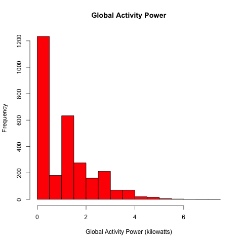
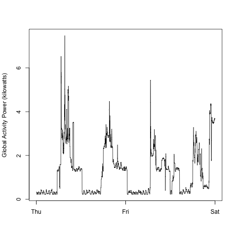
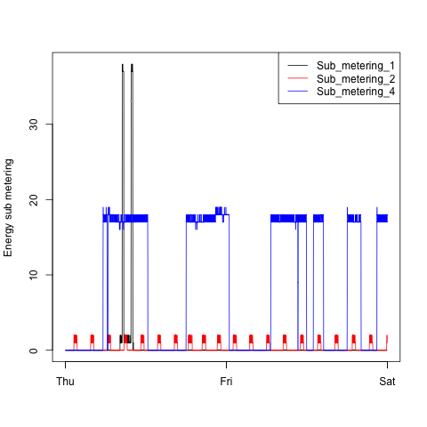
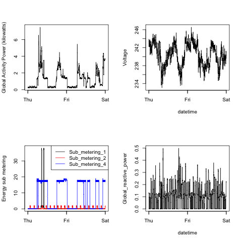

## Output 

This output shows the plots which have been created using the scripts
*plot1.R
*plot2.R
*plot3.R
*plot4.R

the script "dataPreparation.R" is sourced in each of these scripts as it contains the common part of loading the file into a dataframe, converting the variables and filtering the dates as per the instructions.

The section below shows both the original plot and the plot constructed by the script.

### Plot 1

 

### Plot 2 
 

 

### Plot 3
 

 

### Plot 4
 

 

