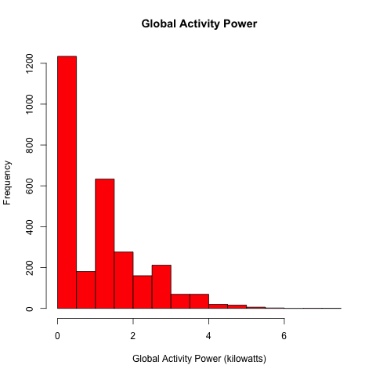
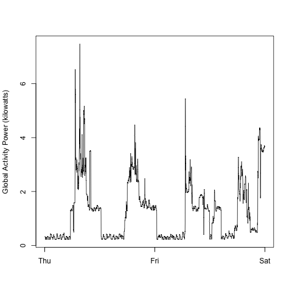
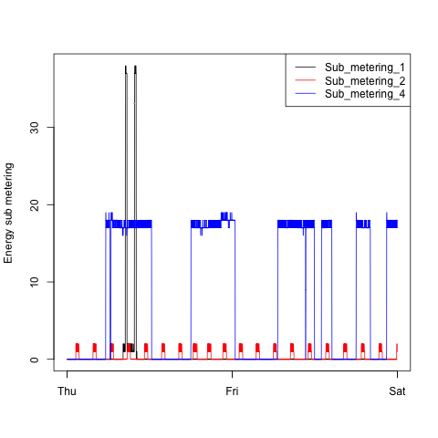
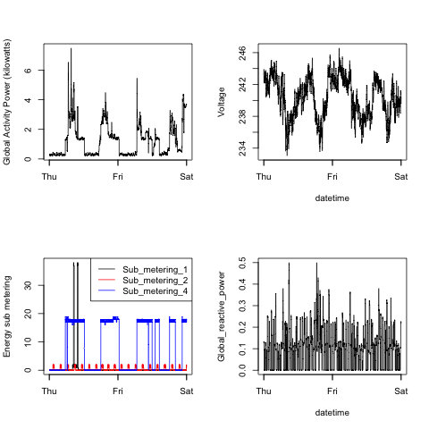

## Output 

This output shows the plots which have been created using the scripts
*plot1.R
*plot2.R
*plot3.R
*plot4.R

the script "dataPreparation.R" is sourced in each of these scripts as it contains the common part of loading the file into a dataframe, converting the variables and filtering the dates as per the instructions.

The figures which have been produces can be found in the "figure" folder

The four plots that have been constructed are shown below. 

### Plot 1 - Original
 

### Plot 1 - constructed by the script
 

### Plot 2 - Original
 

### Plot 2 - constructed by the script
 

### Plot 3
 

### Plot 3 - constructed by the script
 

### Plot 4
 

### Plot 4 - constructed by the script
 

